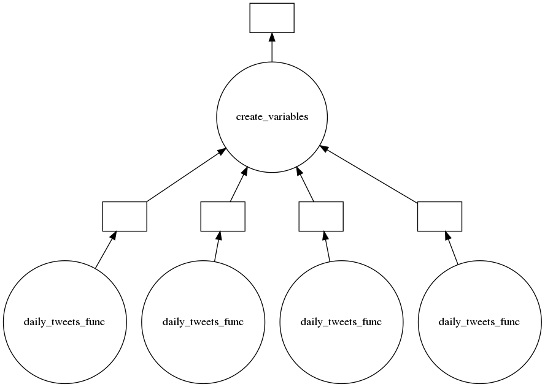

# Extracción y análisis de tweets 

## Introducción

En esta sección se explicará el proceso de obtención de tweets y su análisis, así como los patrones de búsqueda que se utilizaron para obtener tweets confiables que significaran una muestra representativa de la actividad en cierto día sobre cierto tema. 

## Minería de tweets

Este proceso siguió dos grandes etapas de experimentación. En primer lugar, se intentó extraer contenido de twitter directamente desde su API, la cual funciona adecuadamente, sin embargo cuenta con un límite de tweets diarios y no proporciona de manera explícita una metodología para obtener tweets con antigüedad mayor a una semana. En segundo lugar, se utilizó la librería [GetOldTweets3](https://pypi.org/project/GetOldTweets3/), el cual está basado en el proyecto de Jefferson-Henrique [GetOldTweets-python](https://github.com/Jefferson-Henrique/GetOldTweets-python) y permite hacer búsquedas detalladas sobre contenido en twitter. Este paquete hace un proceso de Web scrapping que le permite obtener información de twitter simulando a una persona que navega en la interfaz de la red social. 

El paquete permitió que se realizaran búsquedas específicas que proporcionaran a nuestra investigación información relevante. Los parámetros de búsqueda que se utilizaron fueron: QuerySearch (palabra clave a encontrar dentro de tweets), Username (fuente del tweet), setSince (fecha de inicio de búsqueda), setUntil (fecha límite de búsqueda), setMaxTweets (número máximo de tweets a buscar). Se decidió crear una lista de palabras clave que representaran temas, organismos o empresas que pudieran impactar directamente sobre el IPC de México. Así mismo se elaboró una lista de fuentes confiables sobre las cuales buscar tweets y evitar información sesgada. 

### Lista de palabras clave 

* America Movil
* Banco de México
* México
* Bmv
* Bolsa Mexicana de Valores
* Bolsa Mexicana
* Ipc
* Gobierno de México
* Walmex
* Femsa
* Televisa
* Grupo México
* Banorte
* Cemex
* Grupo Alfa
* Peñoles
* Inbursa
* Elektra
* Mexichem
* Bimbo
* Arca Continental
* Kimberly-Clark
* Genomma Lab
* Puerto de Liverpool
* Grupo Aeroportuario
* Banco Compartamos 
* Alpek
* Ica
* Tv Azteca
* Ohl
* Maseca
* Alsea
* Carso
* Lala
* Banregio
* Comercial Mexicana
* Ienova
* Pinfra
* Santander México
* Presidente de México
* Cetes

### Lista de Fuentes

* El Economista
* El Financiero
* El Universal

Las búsquedas estuvieron basadas en todas las combinaciones posibles que se pueden hacer con estas 3 fuentes y estos 41 temas, dando un total de 123 búsquedas. Además, para evitar que un sólo tweet describiera el sentimiento respecto a un cierto tema, se extrajeron 3 tweets por cada combinación tema-fuente, de esta manera se llegó a un número total de 369 tweets diarios.

## Análisis de sentimiento 

Para el análisis de sentimiento se utilizó la librería [TextBlob](https://textblob.readthedocs.io/en/dev/), la cual procesa datos textuales a través del procesamiento de lenguaje natural. Algunas de sus aplicaciones son: 

* Análisis de sentimiento
* Calsificación de textos
* Traducción de textos
* Tokenización
* N-gramas
* Corrección de ortografía ...

Para el análisis de sentimiento, la librería regresa un par de valores numéricos, el primero relacionado con la *Polaridad* que está en el rango de [-1.0, 1.0] y la *Subjetividad* que está en el rango de [0.0 , 1.0] dónde 0.0 es muy objetivo y 1.0 es muy subjetivo. Para propósitos prácticos del análisis se consideró que un tweet con Polaridad por abajo de 0 sería negativo y un texto por encima de 0 se consideraría positivo. 

## Flujo de Trabajo 

Es importante mencionar el flujo de trabajo que se siguió a lo largo de la extracción y análisis de tweets ya que se necesitaron optimizar ciertos procesos para ahorrar costo computacional, en memoria y tiempo. En primer lugar no se guardaron los tweets obtenidos de la plataforma, se prefirió por el contrario analizar cáda tweet conforme iba entrando al sistema, esto permitió que en lugar de tener una colección de textos en memoria, pudiéramos guardar solo una colección de calificaciones. 

Por otro lado, el proceso de Web scrapping del paquete *GetOldTweets3* presentaba serios problemas de eficiencia de tiempo, aproximadamente se extraían 10 tweets por minuto, lo cual hacía el proceso bastante largo y sugería que para alcanzar 3 años de 369 tweets diarios tendríamos que correr una máquina en AWS por aproximadamente un mes. Este problema se solucionó implementando la manera en que recopilábamos los tweets en paralelo por medio de Dask, lo cual permitió que se paralelizaran baches de un año, teniendo activos 365 nodos (uno por cada día del año) que a su vez hacían el proceso de Web Scrapping simultáneamente. Esto permitió que se pudiera recolectar la información de un año de actividad en twitter en 12 horas. 
 

Diagrama de paralelización en Dask para 4 días. 

## Preparación de información para análisis

 

