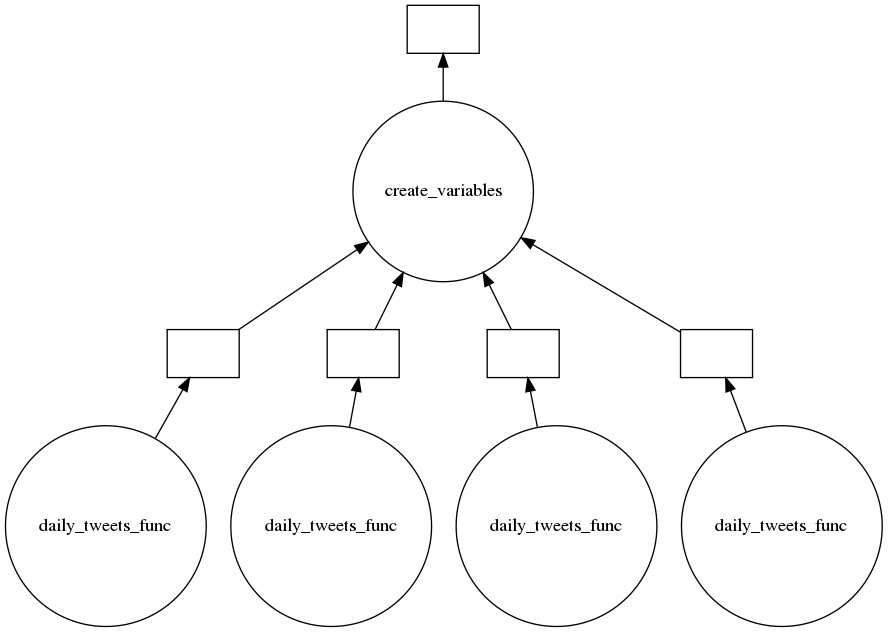

# Tweet extraction and analysis

## Introduction

This section will explain the process of obtaining tweets and their analysis, as well as the search patterns that were used to obtain reliable tweets that would represent a representative sample of the activity on a certain day on a certain topic.

## Tweet mining

This process followed two major stages of experimentation. First, we tried to extract twitter content directly from its API, which works properly, however it has a limit of daily tweets and does not explicitly provide a methodology to obtain tweets older than one week. Second, the library [GetOldTweets3](https://pypi.org/project/GetOldTweets3/) was used, which is based on the Jefferson-Henrique project [GetOldTweets-python](https://github.com/Jefferson-Henrique/GetOldTweets-python) and allows detailed searches on twitter content. This package makes a Web scrapping process that allows you to obtain information from twitter simulating a person who navigates in the social network interface.

The package allowed specific searches to be conducted that would provide our research with relevant information. The search parameters that were used were: QuerySearch (keyword to be found within tweets), Username (source of tweet), setSince (start date of search), setUntil (deadline of search), setMaxTweets (maximum number of tweets to search). It was decided to create a list of keywords that represent issues, organizations or companies that could directly impact the Mexican CPI. A list of reliable sources on which to look for tweets and avoid biased information was also prepared.

### Keyword List

* America Movil
* Banco de México
* México
* Bmv
* Bolsa Mexicana de Valores
* Bolsa Mexicana
* Ipc
* Gobierno de México
* Walmex
* Femsa
* Televisa
* Grupo México
* Banorte
* Cemex
* Grupo Alfa
* Peñoles
* Inbursa
* Elektra
* Mexichem
* Bimbo
* Arca Continental
* Kimberly-Clark
* Genomma Lab
* Puerto de Liverpool
* Grupo Aeroportuario
* Banco Compartamos 
* Alpek
* Ica
* Tv Azteca
* Ohl
* Maseca
* Alsea
* Carso
* Lala
* Banregio
* Comercial Mexicana
* Ienova
* Pinfra
* Santander México
* Presidente de México
* Cetes

### List of sources

* El Economista
* El Financiero
* El Universal

The searches were based on all possible combinations that can be done with these 3 sources and these 41 topics, giving a total of 123 searches. In addition, to prevent a single tweet from describing the feeling regarding a certain subject, 3 tweets were extracted for each theme-source combination, thus reaching a total number of 369 daily tweets.

## Sentiment analysis

For the sentiment analysis, the [TextBlob](https://textblob.readthedocs.io/en/dev/) library was used, which processes textual data through natural language processing. Some of its applications are:

* Sentiment analysis
* Calsification of texts
* Translation of texts
* Tokenization
* N-grams
* Spelling correction ...

For sentiment analysis, the library returns a couple of numerical values, the first one related to the * Polarity * that is in the range of [-1.0, 1.0] and the * Subjectivity * that is in the range of [0.0, 1.0 ] where 0.0 is very objective and 1.0 is very subjective. For practical purposes of the analysis it was considered that a tweet with Polarity below 0 would be negative and a text above 0 would be considered positive.

## Workflow

It is important to mention the workflow that was followed throughout the extraction and analysis of tweets since it was necessary to optimize certain processes to save computational cost, in memory and time. In the first place, the tweets obtained from the platform were not saved, on the contrary it was preferred to analyze each tweet as it entered the system, this allowed that instead of having a collection of texts in memory, we could save only a collection of qualifications.

On the other hand, the Web scrapping process of the * GetOldTweets3 * package presented serious time efficiency problems, approximately 10 tweets per minute were extracted, which made the process quite long and suggested that to reach 3 years of 369 daily tweets we would have to run a machine on AWS for about a month. This problem was solved by implementing the way we collected the tweets in parallel through Dask, which allowed one-year bumps to be parallelized, with 365 nodes active (one for each day of the year) that in turn made the process of Web Scrapping simultaneously (they collected 369 tweets each). This allowed the information of one year of activity on twitter to be collected in 12 hours.

Parallelization diagram in Dask for 4 days.

## Preparation of information for analysis

Finally, the parallel tweet extraction process extracted a csv file per day consisting of a set of three tweets for each combination of the themes and their source. By gathering this information with other dates, two different ways of doing so were discovered, the first referring to the way in which the information is presented and the second referring to the way in which non-working days were treated.

### How to present the information

This approach takes into account the different ways in which the same information can be presented, this has to do with the level of disaggregation of the data. The project used different levels of disaggregation in the following order; source, theme, mix of theme and source, theme_fuente (higher level of disaggregation), mix of everything (we consider that it includes redundant information).
 
### Way to consider non-working days

Although information was collected every day for three years, there is no financial information corresponding to all those days captured, this due to the non-working days of the calendar of the Mexican stock exchange. Based on this problem, it was decided to take two different approaches: the first one incorporates information from the non-working days to the day before the prediction, that is, the Saturday and Sunday tweets are incorporated into the Friday sentiment analysis that will be Useful for predicting performance at the close of Monday. The second approach simply removes the information of the sentiment captured on non-working days, that is, the tweets that were collected on weekends are ignored.

### Data units

The data have consistent units throughout each observation, although initially the negative, positive and neutral tweets (equivalent way of saying there was no information on that topic) were represented by the number of occurrences on the day, including the approximation that incorporating the tweets of non-working days it was decided to express the bias towards a certain feeling as a percentage of the total tweets recorded on that day. This percentage of sentiment made the data normalized in each observation.
